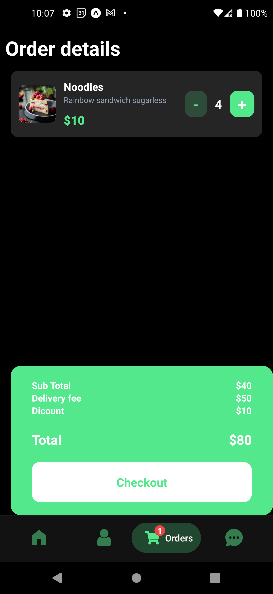

# FOODNINJA

## Table of Contents

- [FOODNINJA](#foodninja)
  - [Table of Contents](#table-of-contents)
  - [Description](#description)
  - [Installation](#installation)
  - [App Link](#app-link)
  - [App Preview](#app-preview)
        - [Login](#login)
        - [Signup](#signup)
        - [Profile setup after signup](#profile-setup-after-signup)
        - [Home page](#home-page)
        - [menu page](#menu-page)
        - [profile page](#profile-page)
        - [cart](#cart)
        - [Popular restaurants](#popular-restaurants)

## Description

**FOODNINJA** is a mobile application that allows users to browse through a list of restaurants, view the menus offered by each restaurant, and place orders for items they are interested in. Users can also manage their profiles by updating their location, changing their name, and adding payment options. This application provides a convenient way for users to explore different dining options and place orders from the comfort of their own homes.

## Installation

1. Clone the repository

   ```bash
   git clone https://github.com/OlamideSimon/food-ninja.git
   ```

2. Navigate to the cloned repository
   ```bash
   cd food-ninja
   ```
3. Install dependencies
   ```bash
   npm install
   or
   yarn
   or
   pnpm
   ```
4. Run the application
   ```bash
   npm start
   or
   yarn start
   or
   pnpm start
   ```

## App Link

https://expo.dev/@olamidesimon/food-ninja

## App Preview

##### Login


##### Signup


##### Profile setup after signup


##### Home page


##### menu page


##### profile page


##### cart




##### Popular restaurants


